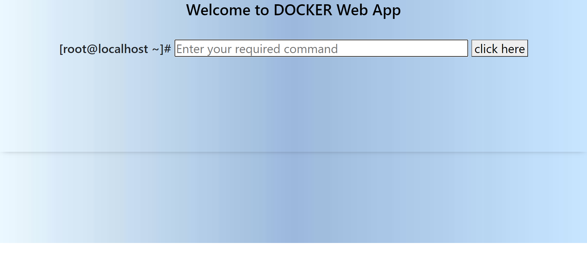

# docker-ajax-cgi
This webapp built using HTML,CSS,JS(AJAX) can run commands on remote server and fetch the results using the concept of CGI AND ASYNC PROGRAMMING.
 
<h2>Screenshots</h2>

	<h2>Working</h2>
		 
        
		 
        
		 
        
	 

